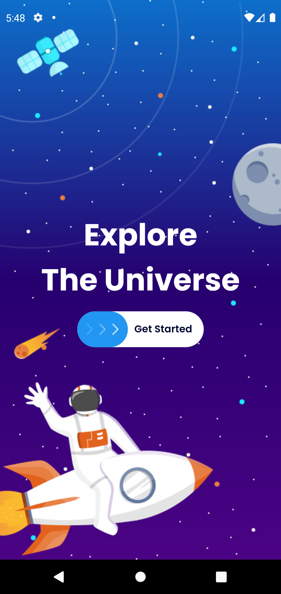
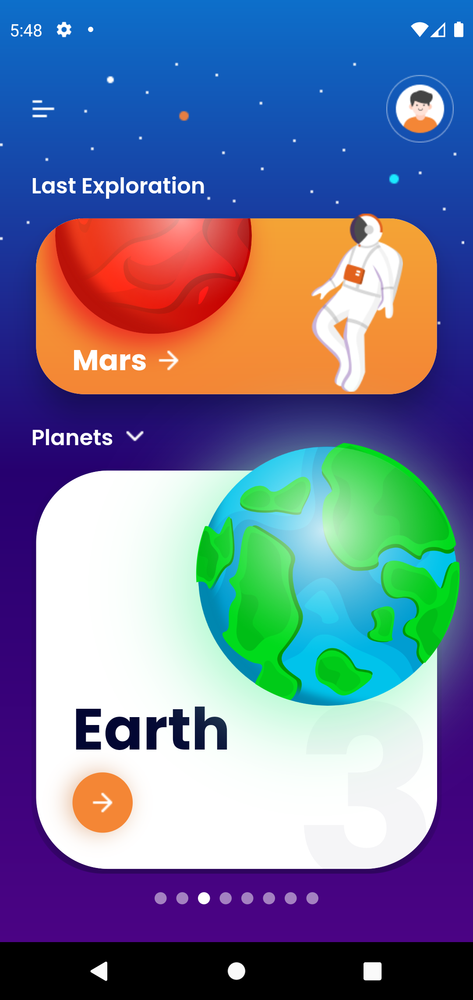
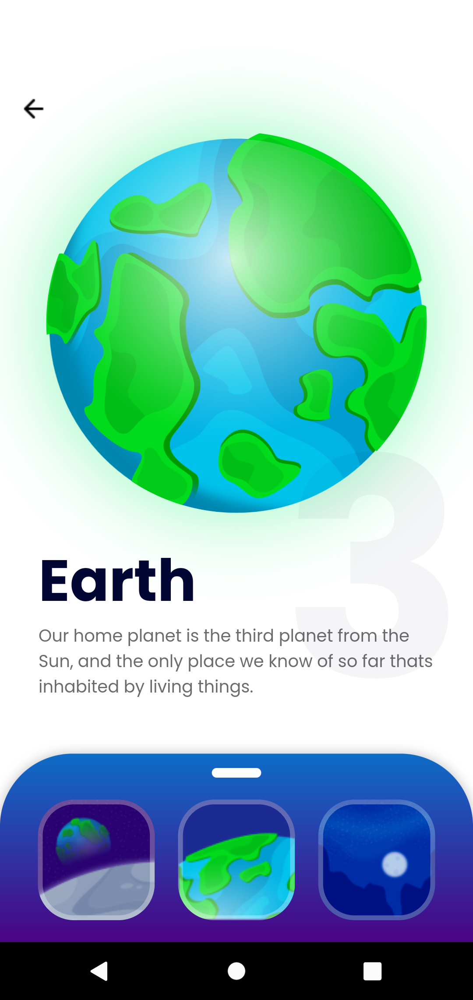

<div align="center">
  
  <h1>Solar System Exploration</h1>
</div>

## ℹ️ About
The Solar System Exploration is an app built with Flutter with the aim of showing information about our inspired solar system through beautiful design.

## 📱 Screenshots

Get Started            |  Home Page          |  Planet Details
:-------------------------:|:-------------------------:|:-------------------------:
  |   | 

> Inspired by the design of: <a href="https://dribbble.com/wprwahyu">Wahyu Pratama</a> 

## 🚀 How To Install

```
Install flutter at: https://docs.flutter.dev/get-started/install

- Clone this repository:
$ git clone https://github.com/joasdc/solar-system.git

- Enter in directory:
$ cd solar-system-exploration

- Install dependencies:
$ flutter pub get

- Run the app: 
$ flutter run
```

## 📫 How To Contribute

```
- Fork the project 

- Create a new branch:
$ git checkout -b my-feature

- Commit Those Changes:
$ git commit -m "feature: My new feature"

- Push your changes:
$ git push origin my-feature
```

## 📝 License
This repository is under MIT license. You can see the <a href="https://github.com/joasdc/solar-system/blob/master/LICENSE.md">LICENSE</a> file for more details. 

## Author

<a href="https://www.linkedin.com/in/joasdc/">
 
 <br />
 <sub><b>Idelfonso Joás</b></sub> 🚀 </a> 


Made with ❤️ by Idelfonso Joás. Contact me!

[](https://www.linkedin.com/in/joasdc/) 
[](mailto:idelfonsojoas@gmail.com)
